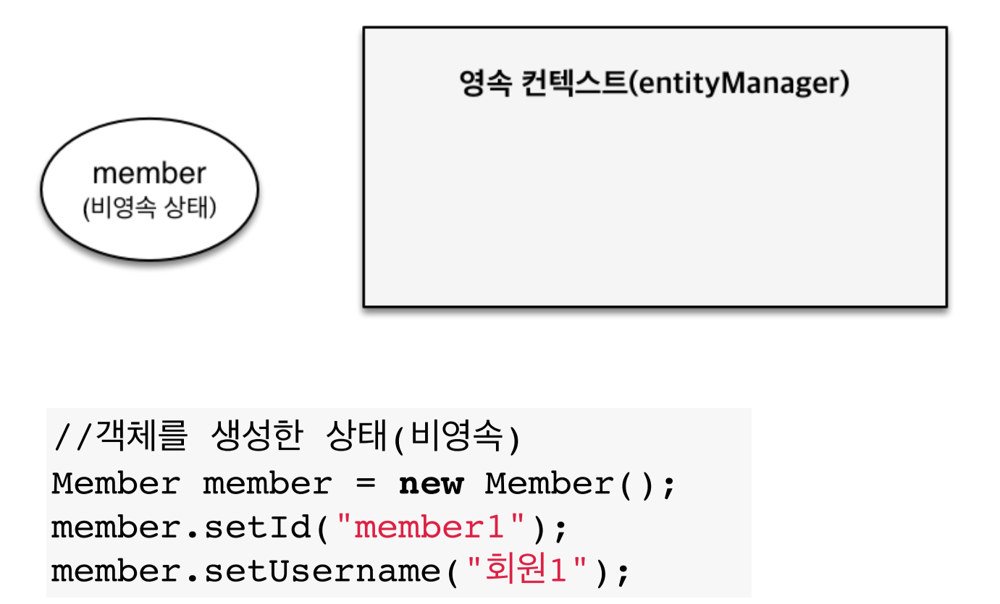

# 2주차

# ◇ 영속성 관리

- JPA에서 가장 중요한 2가지
    - 객체와 관계형 DB 매핑하기
    - 영속성 컨테스트 (실제 JPA가 내부적으로 어떻게 동작?)

## ◆ 영속성 컨테스트

- 엔티티 매니저 팩토리 (이하 EMF)
- 엔티티 매니저 (이하 EM)
    - 고객이 요청 올때마다 EMF가 EM을 생성
    - EM은 커넥션 풀을 활용하여 DB 연결
- 영속성 컨테스트는 JPA를 이해하는데 가장 중요한 용어
- EM을 통해서 영속성 컨테스트에 접근
- 엔티티의 생명주기
    - 비영속(new/transient)
        - 영속성 컨테스트와 전혀 관계가 없는 **새로운** 상태
    - 영속 (managed)
        - 영속성 컨테스트에 **관리**되는 상태
    - 준영속 (detached)
        - 영속성 컨테스트에 저장되었다가 **분리**된 상태
    - 삭제 (removed)
        - **삭제**된 상태

### ◎ 비영속

- 객체만 생성 된 상태



### ◎ 영속

- 객체 생성 후 저장한 상태


- 예제
    
    ```java
    try {
    		//비영속
    		Member member = new Member();
    		member.setId(100L);
    		member.setName("HelloJPA");
    
    		tx.commit();
    			
    }
    ```
    

```java
try {
		//비영속
		Member member = new Member();
		member.setId(100L);
		member.setName("HelloJPA");
		
		//영속
		em.persist(member);
		
		tx.commit();
		
}
```

- EM안의 영속성 컨테스트를 통해 객체가 관리 된다.
- persist 시점이 아닌 뒤에 **commit** 시점에 query가 날아간다.

### ◎ 영속성 컨테스트의 이점

- 1차 캐시
    - 조회할 때, DB보다 1차  캐시에서 우선 조회
        
        
        
    - 캐시 조회 → 해당 데이터 없으면 DB 조회 → 데이터 존재 시, 1차 캐시에 저장 → 반환
        
        
        
    - but, 영속성 컨테스트는 트랜잭션 단위로 사용하기 때문에, **트랜잭션이 종료된 후, 1차 캐시는 날아가** 크게 성능 이점은 없음
- 동일성 (identity) 보장
    
    ```java
    Member findMember1 = em.find(Member.class, 101L);
    Member findMember2 = em.find(Member.class, 101L);
    
    //결과값 true
    System.out.println("result = " + (findMember1 == findMember2));
    ```
    
    - 1차 캐시로 반복 가능한 읽기(Repeatable read) 등급의 [트랜잭션 격리](https://www.notion.so/9aa6df2e7857491e8a45a3bc33259c20) 수준을 DB가 아닌 애플리케이션 차원에서 제공
        - Repeatable Read : **트랜잭션이 시작되기 전에 커밋된 내용에 대해서만 조회할 수 있는 격리수준**
        
        [트랜잭션 격리 수준](https://www.notion.so/9aa6df2e7857491e8a45a3bc33259c20)
        
- 트랜잭션을 지원하는 쓰기 지연 (transactional write-behind)
    - em.persist → SQL 생성 → 쓰기 지연 SQL 저장소, 1차 캐시에 저장 → tx.commit 하면, 저장소에 있던 쿼리가 flush → db commit
    
    
    
    
    
    - JPA는 생성자 사용 시, 무조건 기본 생성자가 있어야 한다. (public 아니어도 괜찮)
    - commit 하기 전, 쿼리를 모았다가 한번에 보낼 수 있다.
    - jdbc.batch_size로 몇개 모아서 db에 넣을지 설정
    
    ```xml
    <property name="hibernate.jdbc.batch_size" value="10" />
    ```
    
- 변경 감지 (Dirty Checking)
    - 변경할 때, **set만 해주고** persist는 하지 않아야 한다!
    - 최초의 상태를 1차 캐시에 스냅샷을 떠놓는다.
    - 커밋되는 시점에 엔티티와 스냅샷 비교 → update/delete sql 생성 → flush → commit
    
    
    
- 지연 로딩 (Lazy Loading)

 

### ◎ 플러시

- 정의 : 영속성 컨테스트의 변경 내용을 DB에 반영
- 플러시 발생 : 변경 감지 → 수정된 엔티티 쓰기 지연 SQL 저장소에 등록 → 쓰기 지연 SQL 저장소의 쿼리를 DB에 전송 (insert, update, delete 쿼리)
- 방법
    1. em.flush() - 직접 호출
        - 호출 되도 1차 캐시 유지
    2. 트랜잭션 커밋 - 플러시 자동 호출
    3. JPQL 쿼리 실행 - 플러시 자동 호출
- 옵션
    - em.setFlushMode(...)로 설정
    1. [FlushModeType.AUTO](http://flushmodetype.AUTO) : 커밋이나 쿼리를 실행할 때, 플러시 (기본값)
    2. FlushModeType.COMMIT : 커밋할 때만 플러시
- 영속성 컨테스트를 비우지 않음
- 영속성 컨테스트 변경내용을 DB에 동기화
- 트랜잭션이라는 작업 단위가 중요 → 커밋 직전에만 동기화 하면 됨

### ◎ 준영속

- 영속 상태의 엔티티가 영속성 컨테스트에서 분리 ( detached )
- 방법
    1. em.detach(entity) : 특정 엔티티만 준영속 상태로 전환
    2. em.clear() : 영속성 컨테스트를 완전히 초기화
    3. em.close() : 영속성 컨테스트를 종료

---

# ◇ Entity 매핑

- 소개
    - 객체와 테이블 매핑 : @Entity, @Table
    - 필드와 컬럼 매핑 : @Column
    - PK 매핑 : @Id
    - 연관관계 매핑 : @ManyToOne, @JoinColumn

## @ Entity

- JPA를 사용해서 테이블과 매핑할 클래스는 @Entity 필수
- 주의
    - **기본 생성자 필수 (public or protected)**
    - final class, enum, interface, inner class 사용 X
    - 저장할 필드에 final 사용 X

## ◆ DB 스키마 자동 생성

- DDL을 애플리케이션 실행 시점에 자동 생성 가능
- 이렇게 생성된 DDL은 **개발 장비에서만 사용**
- 속성
    
    [hibernate.hbm2ddl.auto](https://www.notion.so/d6b3c406623a4f50b3f87426e3c0bd41)
---
# 출처
김영한 JPA 강의
https://www.inflearn.com/course/ORM-JPA-Basic/dashboard