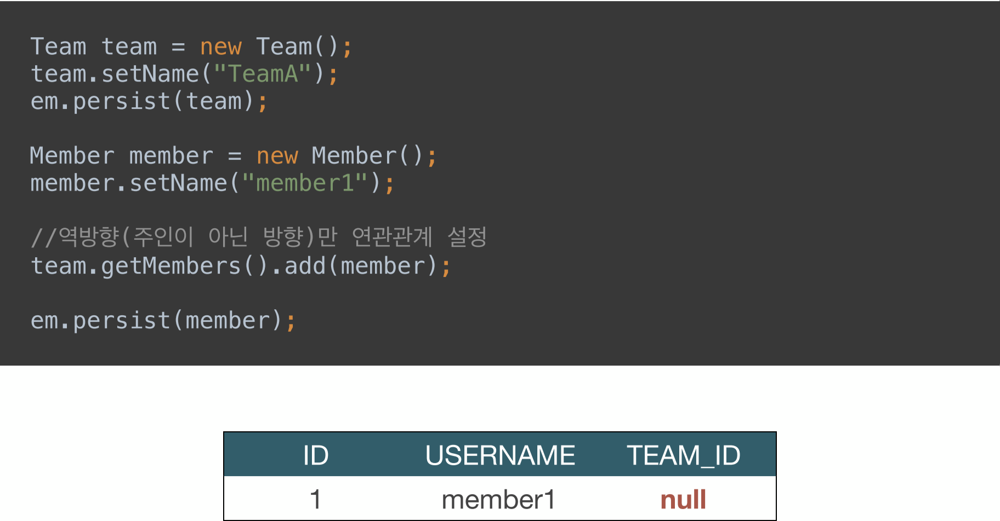
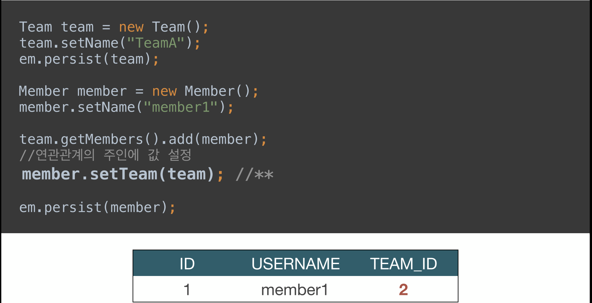

# 3주차

---

# ◆ 연관관계 매핑 기초

- 객체의 참조와 테이블의 외래 키를 매핑
- 방향 : 단방향, 양방향
- 다중성 : 1:N, N:1, 1:1, N:M
- 연관관계의 주인 : 객체 양방향 연관관계는 관리 주인이 필요
- 객체를 테이블에 맞추어 데이터 중심으로 모델링하면 협력 관계를 만들 수 없다.
    - **테이블은 외래 키로 조인**을 사용하여 연관된 테이블을 찾는다.
    - **객체는 참조**를 사용해서 연관된 객체를 찾는다.

## ◇ 단방향 연관관계

- @ManyToOne
    - N:1일 경우, 객체에 @ManyToOne 어노테이션을 붙여서 Join
    - FK값은 @JoinColumn을 사용하여 연결시킴
    - 기본 Fetch 설정은 Eager
    

## ◇양방향 연관관계와 연관관계의 주인

- 테이블은 FK로 양방향 매핑이 다 됨
- 반면 객체는 둘 다 객체를 셋팅해야 매핑이 가능
- @OneToMany
    - 1:N 일 경우, 리스트로 생성
    - mappedBy 옵션을 사용하여, 매핑되는 Entity의 변수 명을 입력
    
    ```java
    public class Team {
    
        @Id @GeneratedValue
        @Column(name = "TEAM_ID")
        private Long id;
        private String name;
    
        @OneToMany(mappedBy = "team")
        private List<Member> members = new ArrayList<Member>();
    		
    		...
    }
    ```
    
    ```java
    @Entity
    public class Member {
    
        @Id @GeneratedValue
        @Column(name = "MEMBER_ID")
    		private Long id;
        
        @Column(name = "USERNAME")
        private String username;
        @ManyToOne()
        @JoinColumn(name = "TEAM_ID")
        private Team team;
    		
    		...
    }
    ```
    
- 객체는 가급적이면 단방향이 좋긴 하다

### ◎ mappedBy

- 객체와 테이블이 관게를 맺는 차이
    - **객체 연관관계 = 2개**
        - 회원 → 팀 연관관계 1개(단방향)
        - 팀 → 회원 연관관계 1개 (단방향)
        - 사실 객체의 양방향 관계는 1개의 양방향 관계가 아닌 2개의 단방향 관계
    - **테이블 연관관계 = 1개**
        - 회원 ↔ 팀의 연관관계 1개 (양방향)
        - FK 1개로 2개 테이블 모두 Join하여 조회 가능
- 연관관계의 주인(Owner)
    - 객체의 두 관계중 하나를 연관관계의 주인으로 지정
    - **연관관계의 주인만이 외래 키를 관리(등록, 수정)**
    - **주인이 아닌 쪽은 읽기만 가능**
        
        → 주인이 아닌 곳에 값을 변경해도 DB는 수정이 되지 않음!!!
        
    - 주인은 mappedBy 속성 사용 X
    - 주인이 아니면 mappedBy 속성으로 주인 지정
- 누구를 주인으로?
    - **외래 키(FK)가 있는 곳**을 주인으로 정해라
        
        → **보통 N쪽(多쪽)이 주인이 됨**
        
    - 예제에서는 Member.team이 연관관계의 주인

 

### ◎ 양방향 매핑시 가장 많이 하는 실수

- 연관관계의 주인에 값을 입력하지 않음



잘못된 예제



정상 예제

- 주인인 Member에 Set을 해줘야 PK 값 Insert
- 주인이 아닌 Team에만 Member를 add 해줄 경우, PK 값이 Insert 되지 않음
- **그냥 양쪽에 다 값을 넣어주는게 맞다!**
    
    → 만약 한쪽에만 넣어 줄 경우, commit 시점에 값이 들어가기 때문에, 중간에 값을 사용하거나 테스트 케이스 경우에 에러가 난다.
    
    - 연관관계 편의 메소드를 생성하자
    
    ```java
    @Entity
    public class Member {
    	...	
    	public void changeTeam(Team team) {
    	        this.team = team;
    	        team.getMembers().add(this);
    	}
    }
    ```
    
- 양방향 매핑시에 무한 루프를 조심하자
    
    ex) toString(), lombok, Json 생성 라이브러리
    
    - **controller에서는 절대 Entity를 반환하지 말아라!!!**
        1. json 생성 라이브러리에서 무한 루프가 발생할 수 있다
        2. entity를 변경하는 순간 api 스펙이 바뀐다.
        
        <aside>
        💡 **Entity는 Dto로 변경해서 반환하는 것을 추천!**
        
        </aside>
        
- 정리
    - **단방향 매핑만으로도 이미 연관관계 매핑은 완료**
    - 양방향 매핑은 반대 방향으로 조회(객체 그래프 탐색) 기능이 추가된 것 뿐
    - JPQL에서 역방향으로 탐색할 일이 많음
    - 단방향 매핑을 잘 하고 양방향은 필요할 때 추가해도 됨 (테이블에 영향 X)
        
        → 실무에서 하다보면 JPQL을 활용하여 복잡한 쿼리를 작성하기 위해 양방향 사용
        

---