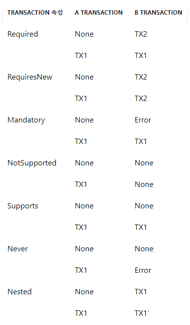

# [Spring] @Transactional 속성 정리

---

---

# **트랜잭션의 ACID 성질**

- 원자성 (Atomicity) : 트랜잭션 내에서 실행한 작업들은 모두 성공하거나, 모두 실패해야 합니다.
- 일관성 (Consistency) : 트랜잭션이 수행되고 나서도 데이터 베이스는 일관성 있게 유지되어야 합니다.
- 격리성 (Isolation) : 트랜잭션을 수행하는 중에 다른 트랜잭션이 연산에 끼어들지 못하도록 격리되어야 합니다.
- 지속성 (Durability) :트랜잭션이 성공적으로 수행되면 그 내용이 영구적으로 반영되어야 합니다.

---

# **트랜잭션의 격리 수준 (Isolation Level)**

## 1. DEFAULT

데이터 베이스에서 설정된 기본 격리 수준을 따릅니다.

## 2. READ_UNCOMMITED

트랜잭션이 아직 커밋되지 않은 데이터를 읽을 수 있습니다. 예를 들어 A라는 트랜잭션에서 데이터를 수정하고, 커밋이 아직 완료되지 않은 상황에서 다른 트랜잭션이 수정중인 데이터를 읽을 수 있습니다. 이러한 경우를 ***Dirty Read*** 라고 합니다. Drity Read 는 READ_UNCOMMITED 격리 수준에서 발생합니다.

## 3. READ_COMMITED

Dirty Read 를 방지하기 위해 Commit 된 데이터만 읽을 수 있습니다. 하지만 NON-REPEATABLE READ 가 발생할 수 있습니다. NON-REPEATABLE READ 는 A 트랜잭션이 a 데이터를 조회 중인데, 중간에 B 트랜잭션이 a 데이터를 수정하고 커밋하게되면 A 트랜잭션이 다시 a 데이터를 조회했을 때, 수정된 데이터가 조회되는 상태입니다. 이름 그대로 반복해서 같은 데이터를 읽을 수 없는 상태를 말합니다.

## 4. REPEATABLE READ

트랜잭션이 완료될 때까지 조회한 모든 데이터에 shared lock이 걸리므로 트랜잭션이 종료될 때까지 다른 트랜잭션은 그 영역에 해당하는 데이터를 수정할 수 없습니다. 먼저 수행된 트랜잭션은 처음 읽은 데이터가 종료될 때까지 같은 데이터를 조회할 수 있으므로 일관성 있는 결과를 리턴할 수 있습니다. 즉, REPEATABLE READ 격리 수준은 NON-REPEATABLE READ 를 허용하지 않습니다. 하지만 PHANTOM READ 상태가 발생할 수 있습니다. PHANTOM READ 는 A 트랜잭션이 10살 이하의 회원을 조회했는데 다른 트랜잭션이 5살 회원을 추가하고 커밋하면 A 트랜잭션이 다시 조회했을 때 회원 하나가 추가된 상태로 조회됩니다. 이와 같이 반복해서 조회했을 때, 결과 집합이 달라지는 상태를 PHANTOM READ 라고 합니다.

## 5. SERIALIZABLE

가장 엄격한 트랜잭션 격리수준으로, 완벽한 읽기 일관성 모드를 제공합니다. 이 격리 수준에서는 PHANTOM READ 상태가 발생하지 않지만 동시성 처리 성능이 급격히 떨어질 수 있습니다.

---

# **트랜잭션 전파 옵션 (Propagation)**

- REQUIRED : 이미 시작된 트랜잭션이 있으면 참여하고, 없으면 새로운 트랜잭션을 시작합니다. (디폴트 속성)
- SUPPORTS : 이미 시작된 트랜잭션이 있으면 참여하고, 없으면 트랜잭션 없이 처리합니다.
- REQUIRED_NEW : 항상 새로운 트랜잭션을 시작합니다. 이미 진행중인 트랜잭션이 있다면 잠시 보류시킵니다.
- MANDATORY : 이미 시작된 트랜잭션이 있으면 참여하고, 없으면 **새로운 트랜색션을 시작하는 대신 예외를 발생**시킵니다. **혼자서는 독립적으로 수행되면 안되는 경우에 사용**됩니다.
- NOT_SUPPORTED : 트랜잭션을 사용하지 않고 처리하도록 합니다. 이미 진행중인 트랜잭션이 있다면 잠시 보류시킵니다.
- NEVER : 트랜잭션을 사용하지 않도록 강제시킵니다. 이미 진행중인 트랜잭션 또한 허용하지 않으며, 있다면 예외를 발생시킵니다.
- NESTED : 이미 실행중인 트랜잭션이 있다면 중첩하여 트랜잭션을 진행합니다. 부모 트랜잭션은 중첩 트랜잭션에 영향을 주지만 중첩 트랜잭션은 부모 트랜잭션에 영향을 주지 않습니다.

---

# **readOnly 옵션**

readOnly 속성을 통해 트랜잭션을 읽기 전용으로 설정할 수 있습니다. 

JPA의 경우, 해당 옵션을 true 로 설정하게 되면 트랜잭션이 커밋되어도 영속성 컨텍스트를 플러시하지 않도록 합니다. 

플러시할 때 수행되는 엔티티의 스냅샷 비교 로직이 수행되지 않으므로 성능을 향상 시킬 수 있습니다.

---

출처

[[Spring] @Transactional 속성 정리](https://icarus8050.tistory.com/23)

[설계경험: WAS에서 트랜잭션 처리](https://www.nextree.co.kr/p3180/)